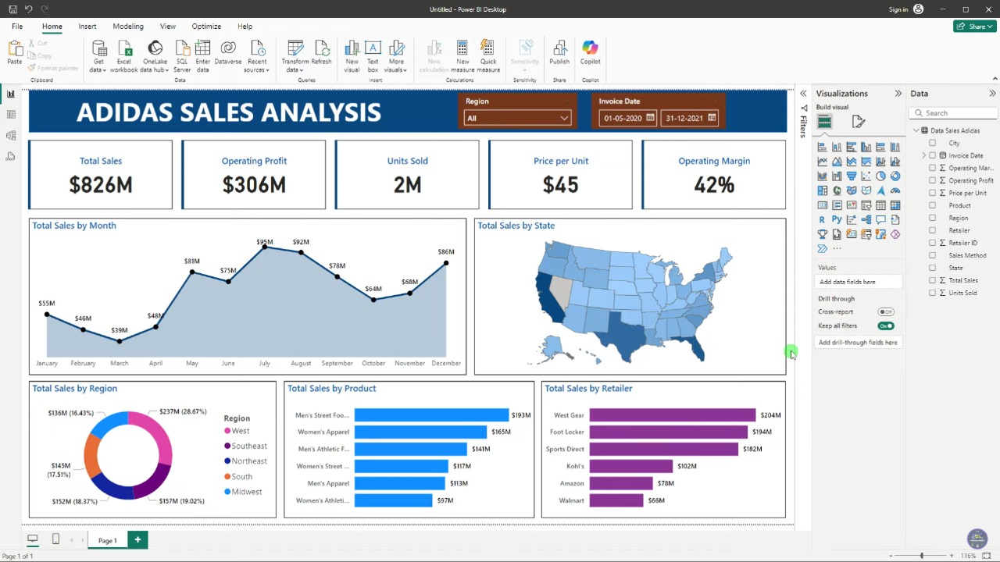

# Adidas Business Sales Analysis - Power BI Project

## Overview
This project presents a comprehensive sales analysis for Adidas using Power BI. It covers various sales dimensions and performance indicators to help Adidas gain insights into their sales patterns, identify key drivers, and make data-driven decisions. The dashboard provides visual representations of total sales, profitability, sales volume, and other critical metrics.

## Project Features

### 1. **Charts Included:**
   - **Total Sales by Month (Area Chart):** Visualize the monthly sales distribution to identify peak sales periods.
   - **Total Sales by State (Filled Map):** Geographically represent total sales across different states.
   - **Total Sales by Region (Donut Chart):** Show the contribution of different regions to total sales.
   - **Total Sales by Product (Bar Chart):** Analyze sales distribution among various Adidas products.
   - **Total Sales by Retailer (Bar Chart):** Visualize the contribution of different retailers to total sales.

### 2. **Key Performance Indicators (KPIs):**
   - **Total Sales Analysis:** Understand the overall sales performance over time.
   - **Profitability Analysis:** Evaluate total profit generated across different dimensions.
   - **Sales Volume Analysis:** Examine total units sold to gain insights into product demand.
   - **Pricing Strategy:** Determine average price per unit to assess the pricing strategy.
   - **Margin Analysis:** Evaluate average margin to understand overall profitability.

### 3. **Business Requirements:**
   - Enhance understanding of sales dynamics and performance drivers.
   - Identify geographical areas with high and low sales potential.
   - Provide insights into product performance to aid inventory and marketing decisions.
   - Inform pricing and margin strategies for improved profitability.
   - Offer actionable recommendations for optimizing sales and profit across various dimensions.

## Tools and Technologies Used
- **Power BI:** For data visualization and dashboard creation.
- **Data Sources:** Sales data for Adidas across regions, products, retailers, and time periods.
- **Charts and Visualizations:** Area chart, filled map, donut chart, bar charts.

## Key Insights
- Identified peak sales months through area charts.
- Analyzed geographical sales distribution across various states.
- Assessed the contribution of different regions and retailers to total sales.
- Evaluated Adidas product sales and identified best-performing products.
- Derived insights into pricing and profitability, aiding in strategic decision-making.

## Conclusion
This Power BI project provides Adidas with a clear understanding of its sales performance, helping drive strategic growth and improve competitive advantage in the sports and athletic industry.
